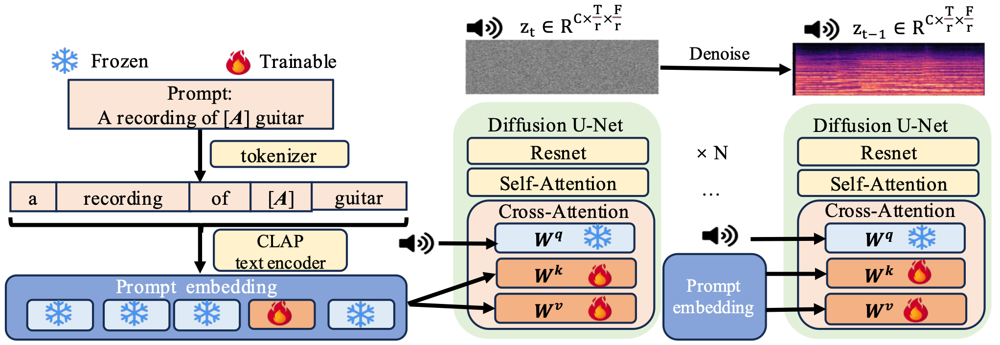

{:.no_toc}

## Overview

Text-to-Music personalization introduces a new concept, as provided by users, into a pre-trained text-to-music model. By leveraging the robust capabilities of the pre-trained model, it facilitates the personalized and customized creation of musical concepts properly. However, existing work lacks the capability to combine multiple new concepts provided by users, which is essential as users often wish to control and combine various personalized music concepts in their wanted ways. To address the aforementioned challenge, we introduce for the first time the task of multi-concept personalization within the text-to-music Diffusion Model. We propose a novel multi-concept personalization method, MultiSound, that fine-tunes the pre-trained model in a joint manner. This is achieved by adjusting the Key and Value weight matrices within the cross-attention layers, enabling a more parameter-efficient and expressively rich multi-concept personalized generation. Furthermore, we employ a novel regularization approach for multi-concept music personalization, designated as the Multi-Prior Preservation, to better maintain pre-trained model’s ability of composing multiple concepts after joint fine-tuning. To the best of our knowledge, MultiSound achieves the state-of-the-art performance in the task of multi-concept personalization. It excels in concept reconstruction metrics, including CLAP-A, FAD-PANN, and FAD-VGG, as well as in the concept editability metric, CLAP-T. The effectiveness of our proposed multi-concept personalization method has been validated by a comprehensive human evaluation study.

## Methodology

An illustration of our proposed fine-tuning strategy. We introduce a new trainable token [A], referred to as the Pseudo Word, within both the tokenizer and the CLAP text encoder. During the fine-tuning process, we focus exclusively on fine-tuning the Pseudo Word itself, along with the weight matrices of keys and values in the cross-attention layers of the pre-trained text-to-music diffusion model. This selective fine-tuning allows us to adapt the model effectively while maintaining the integrity of the pre-trained components.

<table>
    <tr>
        <td >
 
</td>
    </tr>
</table>

Figure.1 The overall architecture of proposed fine-tuning strategy.

## Editability of music concepts

We present multiple models, each fine-tuned with different pairs of concepts. These models enable the generation of combined concepts and support prompt-based control for precise generation of music concepts.

&nbsp;

1.cajon+gtr 

<table>
    <tr>
        <th> a duet between &lt;new1&gt; percussion and &lt;new2&gt; guitar</th>
        <th> a duet featuring a &lt;new1&gt; percussion and a &lt;new2&gt; guitar in a hip hop song </th>
        <th> a recording of &lt;new1&gt; percussion in the background and &lt;new2&gt; guitar</th>
        <th> a recording of a &lt;new1&gt; percussion and &lt;new2&gt; guitar playing together in a small room</th>
    </tr>
    <tr>
        <th> <audio controls id="player" onplay="pauseOthers(this);"><source src="assets/log_audios/cajon_gtr/trained_pipeline_step400/editability_audio/a duet between <new1> percussion and <new2> guitar/a_duet_between_<new1>_percussion_and_<new2>_guitar_9.wav" type="audio/mpeg"></audio> </th>
        <th> <audio controls id="player" onplay="pauseOthers(this);"><source src="assets/log_audios/cajon_gtr/trained_pipeline_step400/editability_audio/a duet featuring a <new1> percussion and a <new2> guitar in a hip hop song/a_duet_featuring_a_<new1>_percussion_and_a_<new2>_guitar_in_a_hip_hop_song_9.wav" type="audio/mpeg"></audio> </th>
        <th> <audio controls id="player" onplay="pauseOthers(this);"><source src="assets/log_audios/cajon_gtr/trained_pipeline_step400/editability_audio/a recording of <new1> percussion in the background and <new2> guitar/a_recording_of_<new1>_percussion_in_the_background_and_<new2>_guitar_9.wav" type="audio/mpeg"></audio> </th>
        <th> <audio controls id="player" onplay="pauseOthers(this);"><source src="assets/log_audios/cajon_gtr/trained_pipeline_step400/editability_audio/a recording of a <new1> percussion and <new2> guitar playing together in a small room/a_recording_of_a_<new1>_percussion_and_<new2>_guitar_playing_together_in_a_small_room_9.wav" type="audio/mpeg"></audio> </th>
    </tr> 
</table>

&nbsp;
 
2.jingle+toere 

<table>
    <tr>
        <th> a duet between &lt;new1&gt; guitar and &lt;new2&gt; percussion</th>
        <th> a duet featuring a &lt;new1&gt; guitar and a &lt;new2&gt; percussion in a hip hop song </th>
        <th> a recording of &lt;new1&gt; guitar in the background and &lt;new2&gt; percussion</th>
        <th> a recording of a &lt;new1&gt; guitar and &lt;new2&gt; percussion playing together in a small room</th>
    </tr>
    <tr>
        <th> <audio controls id="player" onplay="pauseOthers(this);"><source src="assets/log_audios/jingle_toere/trained_pipeline_step400/editability_audio/a duet between <new1> guitar and <new2> percussion/a_duet_between_<new1>_guitar_and_<new2>_percussion_15.wav" type="audio/mpeg"></audio> </th>
        <th> <audio controls id="player" onplay="pauseOthers(this);"><source src="assets/log_audios/jingle_toere/trained_pipeline_step400/editability_audio/a duet featuring a <new1> guitar and a <new2> percussion in a hip hop song/a_duet_featuring_a_<new1>_guitar_and_a_<new2>_percussion_in_a_hip_hop_song_3.wav" type="audio/mpeg"></audio> </th>
        <th> <audio controls id="player" onplay="pauseOthers(this);"><source src="assets/log_audios/jingle_toere/trained_pipeline_step400/editability_audio/a recording of <new1> guitar in the background and <new2> percussion/a_recording_of_<new1>_guitar_in_the_background_and_<new2>_percussion_9.wav" type="audio/mpeg"></audio> </th>
        <th> <audio controls id="player" onplay="pauseOthers(this);"><source src="assets/log_audios/jingle_toere/trained_pipeline_step400/editability_audio/a recording of a <new1> guitar and <new2> percussion playing together in a small room/a_recording_of_a_<new1>_guitar_and_<new2>_percussion_playing_together_in_a_small_room_9.wav" type="audio/mpeg"></audio> </th>
    </tr> 
</table>

&nbsp;

3.kashaka+sitar 

<table>
    <tr>
        <th> a duet between &lt;new1&gt; percussion and &lt;new2&gt; string instrument</th>
        <th> a duet featuring a &lt;new1&gt; percussion and a &lt;new2&gt; string instrument in a hip hop song </th>
        <th> a recording of &lt;new1&gt; percussion in the background and &lt;new2&gt; string instrument</th>
        <th> a recording of a &lt;new1&gt; percussion and &lt;new2&gt; string instrument playing together in a small room</th>
    </tr>
    <tr>
        <th> <audio controls id="player" onplay="pauseOthers(this);"><source src="assets/log_audios/kashaka_sitar/trained_pipeline_step400/editability_audio/a duet between <new1> percussion and <new2> string instrument/a_duet_between_<new1>_percussion_and_<new2>_string_instrument_9.wav" type="audio/mpeg"></audio> </th>
        <th> <audio controls id="player" onplay="pauseOthers(this);"><source src="assets/log_audios/kashaka_sitar/trained_pipeline_step400/editability_audio/a duet featuring a <new1> percussion and a <new2> string instrument in a hip hop song/a_duet_featuring_a_<new1>_percussion_and_a_<new2>_string_instrument_in_a_hip_hop_song_16.wav" type="audio/mpeg"></audio> </th>
        <th> <audio controls id="player" onplay="pauseOthers(this);"><source src="assets/log_audios/kashaka_sitar/trained_pipeline_step400/editability_audio/a recording of <new1> percussion in the background and <new2> string instrument/a_recording_of_<new1>_percussion_in_the_background_and_<new2>_string_instrument_7.wav" type="audio/mpeg"></audio> </th>
        <th> <audio controls id="player" onplay="pauseOthers(this);"><source src="assets/log_audios/kashaka_sitar/trained_pipeline_step400/editability_audio/a recording of a <new1> percussion and <new2> string instrument playing together in a small room/a_recording_of_a_<new1>_percussion_and_<new2>_string_instrument_playing_together_in_a_small_room_9.wav" type="audio/mpeg"></audio> </th>
    </tr> 
</table>

&nbsp;

4.morricone+shehnai 

<table>
    <tr>
        <th> a duet between &lt;new1&gt; classical music and &lt;new2&gt; wind instrument</th>
        <th> a duet featuring &lt;new1&gt; classical music and &lt;new2&gt; wind instrument in a hip hop song </th>
        <th> a recording of &lt;new1&gt; classical music in the background and &lt;new2&gt; wind instrument</th>
        <th> a recording of &lt;new1&gt; classical music and &lt;new2&gt; wind instrument playing together in a small room</th>
    </tr>
    <tr>
        <th> <audio controls id="player" onplay="pauseOthers(this);"><source src="assets/log_audios/morricone_shehnai/trained_pipeline_step400/editability_audio/a duet between <new1> classical music and <new2> wind instrument/a_duet_between_<new1>_classical_music_and_<new2>_wind_instrument_9.wav" type="audio/mpeg"></audio> </th>
        <th> <audio controls id="player" onplay="pauseOthers(this);"><source src="assets/log_audios/morricone_shehnai/trained_pipeline_step400/editability_audio/a duet featuring a <new1> classical music and a <new2> wind instrument in a hip hop song/a_duet_featuring_a_<new1>_classical_music_and_a_<new2>_wind_instrument_in_a_hip_hop_song_9.wav" type="audio/mpeg"></audio> </th>
        <th> <audio controls id="player" onplay="pauseOthers(this);"><source src="assets/log_audios/morricone_shehnai/trained_pipeline_step400/editability_audio/a recording of <new1> classical music in the background and <new2> wind instrument/a_recording_of_<new1>_classical_music_in_the_background_and_<new2>_wind_instrument_9.wav" type="audio/mpeg"></audio> </th>
        <th> <audio controls id="player" onplay="pauseOthers(this);"><source src="assets/log_audios/morricone_shehnai/trained_pipeline_step400/editability_audio/a recording of a <new1> classical music and <new2> wind instrument playing together in a small room/a_recording_of_a_<new1>_classical_music_and_<new2>_wind_instrument_playing_together_in_a_small_room_9.wav" type="audio/mpeg"></audio> </th>
    </tr> 
</table>

&nbsp;

5.ode+rumaba 

<table>
    <tr>
        <th> a duet between &lt;new1&gt; classical music and &lt;new2&gt; drum beat</th>
        <th> a duet featuring &lt;new1&gt; classical music and &lt;new2&gt; drum beat in a hip hop song </th>
        <th> a recording of &lt;new1&gt; classical music in the background and &lt;new2&gt; drum beat</th>
        <th> a recording of &lt;new1&gt; classical music and &lt;new2&gt; drum beat playing together in a small room</th>
    </tr>
    <tr>
        <th> <audio controls id="player" onplay="pauseOthers(this);"><source src="assets/log_audios/ode_rumaba/trained_pipeline_step400/editability_audio/a duet between <new1> classical music and <new2> drum beat/a_duet_between_<new1>_classical_music_and_<new2>_drum_beat_9.wav" type="audio/mpeg"></audio> </th>
        <th> <audio controls id="player" onplay="pauseOthers(this);"><source src="assets/log_audios/ode_rumaba/trained_pipeline_step400/editability_audio/a duet featuring a <new1> classical music and a <new2> drum beat in a hip hop song/a_duet_featuring_a_<new1>_classical_music_and_a_<new2>_drum_beat_in_a_hip_hop_song_9.wav" type="audio/mpeg"></audio> </th>
        <th> <audio controls id="player" onplay="pauseOthers(this);"><source src="assets/log_audios/ode_rumaba/trained_pipeline_step400/editability_audio/a recording of <new1> classical music in the background and <new2> drum beat/a_recording_of_<new1>_classical_music_in_the_background_and_<new2>_drum_beat_9.wav" type="audio/mpeg"></audio> </th>
        <th> <audio controls id="player" onplay="pauseOthers(this);"><source src="assets/log_audios/ode_rumaba/trained_pipeline_step400/editability_audio/a recording of a <new1> classical music and <new2> drum beat playing together in a small room/a_recording_of_a_<new1>_classical_music_and_<new2>_drum_beat_playing_together_in_a_small_room_9.wav" type="audio/mpeg"></audio> </th>
    </tr> 
</table>

&nbsp;

6.shehnai+tsifteteli 

<table>
    <tr>
        <th> a duet between &lt;new1&gt; wind instrument and &lt;new2&gt; drum beat</th>
        <th> a duet featuring &lt;new1&gt; wind instrument and &lt;new2&gt; drum beat in a hip hop song </th>
        <th> a recording of &lt;new1&gt; wind instrument in the background and &lt;new2&gt; drum beat</th>
        <th> a recording of &lt;new1&gt; wind instrument and &lt;new2&gt; drum beat playing together in a small room</th>
    </tr>
    <tr>
        <th> <audio controls id="player" onplay="pauseOthers(this);"><source src="assets/log_audios/shehnai_tsifteteli/trained_pipeline_step400/editability_audio/a duet between <new1> wind instrument and <new2> drum beat/a_duet_between_<new1>_wind_instrument_and_<new2>_drum_beat_9.wav" type="audio/mpeg"></audio> </th>
        <th> <audio controls id="player" onplay="pauseOthers(this);"><source src="assets/log_audios/shehnai_tsifteteli/trained_pipeline_step400/editability_audio/a duet featuring a <new1> wind instrument and a <new2> drum beat in a hip hop song/a_duet_featuring_a_<new1>_wind_instrument_and_a_<new2>_drum_beat_in_a_hip_hop_song_9.wav" type="audio/mpeg"></audio> </th>
        <th> <audio controls id="player" onplay="pauseOthers(this);"><source src="assets/log_audios/shehnai_tsifteteli/trained_pipeline_step400/editability_audio/a recording of <new1> wind instrument in the background and <new2> drum beat/a_recording_of_<new1>_wind_instrument_in_the_background_and_<new2>_drum_beat_9.wav" type="audio/mpeg"></audio> </th>
        <th> <audio controls id="player" onplay="pauseOthers(this);"><source src="assets/log_audios/shehnai_tsifteteli/trained_pipeline_step400/editability_audio/a recording of a <new1> wind instrument and <new2> drum beat playing together in a small room/a_recording_of_a_<new1>_wind_instrument_and_<new2>_drum_beat_playing_together_in_a_small_room_9.wav" type="audio/mpeg"></audio> </th>
    </tr> 
</table>

&nbsp;

## Reconstruction of music concepts

We present multiple models, each fine-tuned with different pairs of concepts, demonstrating their ability to accurately reconstruct individual concepts.(There are five training audios per concept, only one is showed here to demonstrate the reconstruction ability of our models)

&nbsp;
 
1.cajon+gtr 
reconstruction prompt for cajon: a recording of &lt;new1&gt; percussion 
reconstruction prompt for gtr: a recording of &lt;new2&gt; guitar 

<table>
    <tr>
        <th> training audio(cajon)</th>
        <th> reconstruction audio(cajon) </th>
        <th> training audio(gtr)</th>
        <th> reconstruction audio(gtr)</th>
    </tr>
    <tr>
        <th> <audio controls id="player" onplay="pauseOthers(this);"><source src="assets/log_audios/cajon_gtr/training_audio/cajon/cajon_60.0-70.0.wav" type="audio/mpeg"></audio> </th>
        <th> <audio controls id="player" onplay="pauseOthers(this);"><source src="assets/log_audios/cajon_gtr/trained_pipeline_step400/reconstruction_audio/cajon/a_recording_of_<new1>_percussion_0.wav" type="audio/mpeg"></audio> </th>
        <th> <audio controls id="player" onplay="pauseOthers(this);"><source src="assets/log_audios/cajon_gtr/training_audio/gtr/1.wav" type="audio/mpeg"></audio> </th>
        <th> <audio controls id="player" onplay="pauseOthers(this);"><source src="assets/log_audios/cajon_gtr/trained_pipeline_step400/reconstruction_audio/gtr/a_recording_of_<new2>_guitar_0.wav" type="audio/mpeg"></audio> </th>
    </tr> 
</table>

&nbsp;
 
2.jingle+toere 
reconstruction prompt for jingle: a recording of &lt;new1&gt; guitar 
reconstruction prompt for toere: a recording of &lt;new2&gt; percussion 

<table>
    <tr>
        <th> training audio(jingle)</th>
        <th> reconstruction audio(jingle) </th>
        <th> training audio(toere)</th>
        <th> reconstruction audio(toere)</th>
    </tr>
    <tr>
        <th> <audio controls id="player" onplay="pauseOthers(this);"><source src="assets/log_audios/jingle_toere/training_audio/jingle/jingle_29.0-39.0.wav" type="audio/mpeg"></audio> </th>
        <th> <audio controls id="player" onplay="pauseOthers(this);"><source src="assets/log_audios/jingle_toere/trained_pipeline_step400/reconstruction_audio/jingle/a_recording_of_<new1>_guitar_10.wav" type="audio/mpeg"></audio> </th>
        <th> <audio controls id="player" onplay="pauseOthers(this);"><source src="assets/log_audios/jingle_toere/training_audio/toere/toere_10.0-20.0.wav" type="audio/mpeg"></audio> </th>
        <th> <audio controls id="player" onplay="pauseOthers(this);"><source src="assets/log_audios/jingle_toere/trained_pipeline_step400/reconstruction_audio/toere/a_recording_of_<new2>_percussion_1.wav" type="audio/mpeg"></audio> </th>
    </tr> 
</table>
3.kashaka+sitar 
reconstruction prompt for kashaka: a recording of &lt;new1&gt; percussion 
reconstruction prompt for sitar: a recording of &lt;new2&gt; string instrument 

<table>
    <tr>
        <th> training audio(kashaka)</th>
        <th> reconstruction audio(kashaka) </th>
        <th> training audio(sitar)</th>
        <th> reconstruction audio(sitar)</th>
    </tr>
    <tr>
        <th> <audio controls id="player" onplay="pauseOthers(this);"><source src="assets/log_audios/kashaka_sitar/training_audio/kashaka/kashaka_0.0-10.0.wav" type="audio/mpeg"></audio> </th>
        <th> <audio controls id="player" onplay="pauseOthers(this);"><source src="assets/log_audios/kashaka_sitar/trained_pipeline_step400/reconstruction_audio/kashaka/a_recording_of_<new1>_percussion_5.wav" type="audio/mpeg"></audio> </th>
        <th> <audio controls id="player" onplay="pauseOthers(this);"><source src="assets/log_audios/kashaka_sitar/training_audio/sitar/sitar_30.0-40.0.wav" type="audio/mpeg"></audio> </th>
        <th> <audio controls id="player" onplay="pauseOthers(this);"><source src="assets/log_audios/kashaka_sitar/trained_pipeline_step400/reconstruction_audio/sitar/a_recording_of_<new2>_string_instrument_15.wav" type="audio/mpeg"></audio> </th>
    </tr> 
</table>
4.morricone+shehnai 
reconstruction prompt for morricone: a recording of &lt;new1&gt; classical music 
reconstruction prompt for shehnai: a recording of &lt;new2&gt; wind instrument 

<table>
    <tr>
        <th> training audio(morricone)</th>
        <th> reconstruction audio(morricone) </th>
        <th> training audio(shehnai)</th>
        <th> reconstruction audio(shehnai)</th>
    </tr>
    <tr>
        <th> <audio controls id="player" onplay="pauseOthers(this);"><source src="assets/log_audios/morricone_shehnai/training_audio/morricone/morricone_30.0-40.0.wav" type="audio/mpeg"></audio> </th>
        <th> <audio controls id="player" onplay="pauseOthers(this);"><source src="assets/log_audios/morricone_shehnai/trained_pipeline_step400/reconstruction_audio/morricone/a_recording_of_<new1>_classical_music_16.wav" type="audio/mpeg"></audio> </th>
        <th> <audio controls id="player" onplay="pauseOthers(this);"><source src="assets/log_audios/morricone_shehnai/training_audio/shehnai/shehnai_100.0-110.0.wav" type="audio/mpeg"></audio> </th>
        <th> <audio controls id="player" onplay="pauseOthers(this);"><source src="assets/log_audios/morricone_shehnai/trained_pipeline_step400/reconstruction_audio/shehnai/a_recording_of_<new2>_wind_instrument_2.wav" type="audio/mpeg"></audio> </th>
    </tr> 
</table>
5.ode+rumaba 
reconstruction prompt for ode: a recording of &lt;new1&gt; classical music 
reconstruction prompt for rumaba: a recording of &lt;new2&gt; drum beat 

<table>
    <tr>
        <th> training audio(ode)</th>
        <th> reconstruction audio(ode) </th>
        <th> training audio(rumaba)</th>
        <th> reconstruction audio(rumaba)</th>
    </tr>
    <tr>
        <th> <audio controls id="player" onplay="pauseOthers(this);"><source src="assets/log_audios/ode_rumaba/training_audio/ode/ode_450.0-460.0.wav" type="audio/mpeg"></audio> </th>
        <th> <audio controls id="player" onplay="pauseOthers(this);"><source src="assets/log_audios/ode_rumaba/trained_pipeline_step400/reconstruction_audio/ode/a_recording_of_<new1>_classical_music_5.wav" type="audio/mpeg"></audio> </th>
        <th> <audio controls id="player" onplay="pauseOthers(this);"><source src="assets/log_audios/ode_rumaba/training_audio/rumaba/rumaba_10.0-20.0.wav" type="audio/mpeg"></audio> </th>
        <th> <audio controls id="player" onplay="pauseOthers(this);"><source src="assets/log_audios/ode_rumaba/trained_pipeline_step400/reconstruction_audio/rumaba/a_recording_of_<new2>_drum_beat_7.wav" type="audio/mpeg"></audio> </th>
    </tr> 
</table>
6.shehnai+tsifteteli 
reconstruction prompt for shehnai: a recording of &lt;new1&gt; wind instrument 
reconstruction prompt for tsifteteli: a recording of &lt;new2&gt; drum beat 

<table>
    <tr>
        <th> training audio(shehnai)</th>
        <th> reconstruction audio(shehnai) </th>
        <th> training audio(tsifteteli)</th>
        <th> reconstruction audio(tsifteteli)</th>
    </tr>
    <tr>
        <th> <audio controls id="player" onplay="pauseOthers(this);"><source src="assets/log_audios/shehnai_tsifteteli/training_audio/shehnai/shehnai_100.0-110.0.wav" type="audio/mpeg"></audio> </th>
        <th> <audio controls id="player" onplay="pauseOthers(this);"><source src="assets/log_audios/shehnai_tsifteteli/trained_pipeline_step400/reconstruction_audio/shehnai/a_recording_of_<new1>_wind_instrument_15.wav" type="audio/mpeg"></audio> </th>
        <th> <audio controls id="player" onplay="pauseOthers(this);"><source src="assets/log_audios/shehnai_tsifteteli/training_audio/tsifteteli/tsifteteli_40.0-50.0.wav" type="audio/mpeg"></audio> </th>
        <th> <audio controls id="player" onplay="pauseOthers(this);"><source src="assets/log_audios/shehnai_tsifteteli/trained_pipeline_step400/reconstruction_audio/tsifteteli/a_recording_of_<new2>_drum_beat_19.wav" type="audio/mpeg"></audio> </th>
    </tr> 
</table>

## Explanation on the music concepts we use
<!-- 我们使用了论文(Plitsis et al. 2023)中的数据集，并且对于我们提出的多概念个性化生成任务，我们随机选择了其中的六个概念对进行实验，其中涉及到的所有概念的解释如下： -->
We used the dataset from the paper by Plitsis et al. (2023) and for our proposed multi-concept personalization generation task, we randomly selected six pairs of concepts for experimentation. The explanations of all the concepts involved are as follows:
1. **Cajon**: A box-shaped percussion instrument originally from Peru, played by slapping its front or rear faces.
2. **Guitar**: A stringed musical instrument typically played by plucking or strumming, commonly used in various music genres.
3. **Jingle**: A short, catchy piece of music or melody often used in advertisements.
4. **Toere**: A traditional Polynesian slit drum made from wood, used in ceremonial and cultural music.
5. **Kashaka**: A West African percussion instrument consisting of two small gourds filled with seeds, connected by a string, and shaken to create rhythmic patterns.
6. **Sitar**: A long-necked stringed instrument from India, known for its complex sound and used in classical Indian music.
7. **Morricone**: Refers to the musical style or compositions of Ennio Morricone, an Italian composer famous for his film scores, particularly in Westerns.
8. **Shehnai**: A traditional Indian wind instrument, similar to an oboe, used in classical and folk music.
9. **Ode**: A lyrical poem or piece of music that is a tribute to a particular subject, often expressing deep emotion.
10. **Rumba**: A genre of Cuban music and dance with African influences, known for its lively rhythms.
11. **Tsifteteli**: A traditional Greek and Middle Eastern dance and music style, characterized by its rhythmic and sensuous movements.
## reference
Plitsis, M.; Kouzelis, T.; Paraskevopoulos, G.; Katsouros, V.; and Panagakis, Y. 2023. Investigating Personaliza- tion Methods in Text to Music Generation. arXiv preprint arXiv:2309.11140.

